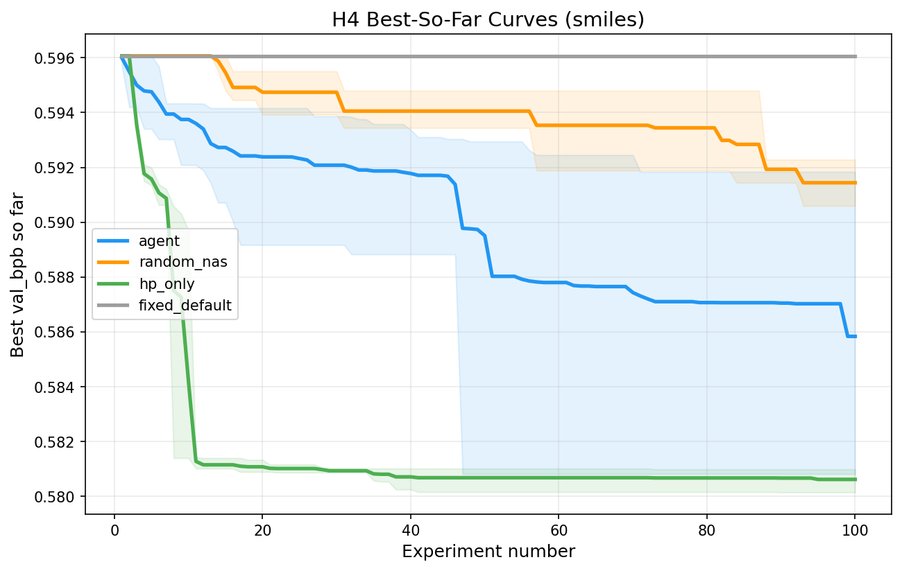
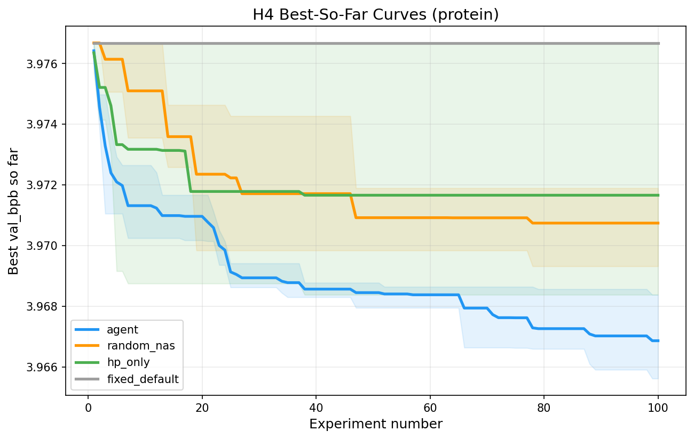
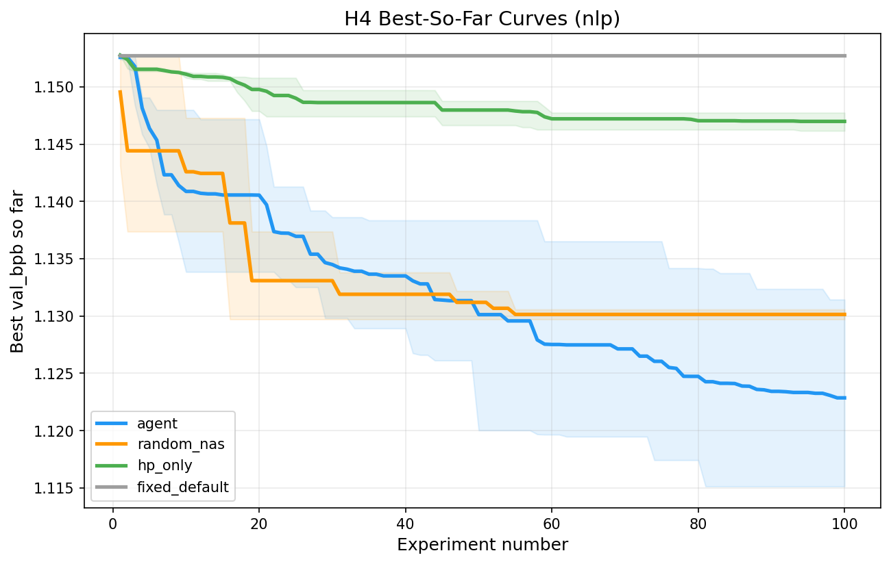

# autoresearch-mol

Autonomous discovery of domain-specific transformer architectures for molecular sequences.

## Background

[autoresearch](https://github.com/karpathy/autoresearch) by Andrej Karpathy showed that an AI agent can autonomously improve a transformer by iterating on `train.py` in a tight loop: modify, train 5 minutes, evaluate, keep or discard. The result was impressive, but it only ran on NLP data.

We took that idea and pointed it at molecules. Same loop, same single-GPU constraint, but across three domains simultaneously: drug-like molecules (SMILES), proteins, and NLP as a control. Then we added baselines that nobody had run (random architecture search, hyperparameter-only tuning, and a fixed default) to answer a question the original work didn't address: **does the architecture search actually matter, or is the agent mostly finding better hyperparameters?**

## What We Found

  

After 3,106 experiments across 4 conditions and 3 domains:

- **It depends on the domain.** Architecture search contributes 81% of improvement for NLP but is counterproductive for SMILES, where hyperparameter tuning alone beats the full agent.
- **Architectures cluster by domain** (p=0.004) — the agent discovers genuinely different designs for molecules vs. text.
- **But all innovations transfer.** 41/41 discovered architectural changes work across all three domains with <1% degradation. The search paths diverge, but the discoveries are universal.
- **Practical takeaway:** Small vocab + short sequences (like SMILES) → just tune hyperparameters. Large vocab + long sequences (like NLP) → architecture search pays off.

## How It Works

Built on the autoresearch loop:

1. **Calibration** — Verify that 5-minute training runs reliably rank architectures (Spearman rho=0.54, p=0.014).
2. **Agent search** — ~100 iterations per track. The agent modifies architecture and hyperparameters, trains, evaluates, keeps improvements.
3. **Baselines** — Random NAS, HP-only agent, and fixed default establish what the agent adds beyond brute-force search.
4. **Analysis** — 4 pre-registered hypotheses tested with permutation tests, bootstrap CIs, and Bonferroni correction.

## Domains

| Track | Dataset | Vocab | Seq length | Experiments |
|-------|---------|-------|------------|-------------|
| SMILES | ZINC-250K | ~50 chars | 256 | 1,034 |
| Protein | UniRef50 | ~25 AA | 512 | 1,038 |
| NLP | FineWeb-Edu | ~8K BPE | 2048 | 1,034 |

## Quick Start

**Requirements:** Single NVIDIA GPU (tested on A10G 24GB), Python 3.10+, [uv](https://docs.astral.sh/uv/).

```bash
# Install dependencies
cd src && uv sync

# Prepare data
uv run prepare_smiles.py   # SMILES track
uv run prepare_protein.py  # Protein track
uv run prepare.py          # NLP track

# Run a single training experiment
RECURSIVE_MOL_TRACK=smiles uv run train.py
```

## Project Status

| Phase | Status |
|-------|--------|
| 1. Infrastructure | ✅ Complete |
| 2. Agent Search (3,106 experiments) | ✅ Complete |
| 3. Baselines (random NAS, HP-only, fixed) | ✅ Complete |
| 4. Statistical Analysis (H1–H4) | ✅ Complete |
| 5. Paper (NeurIPS 2026) | 🔄 In progress |

## License

MIT
